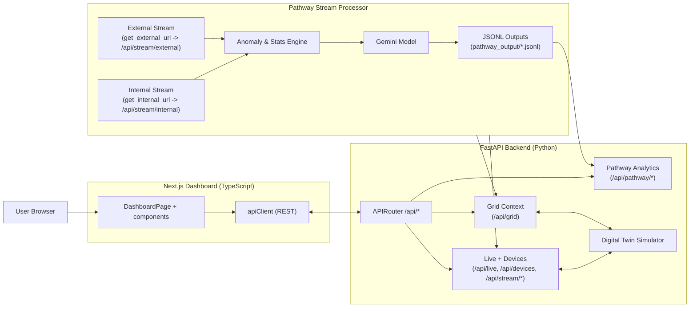
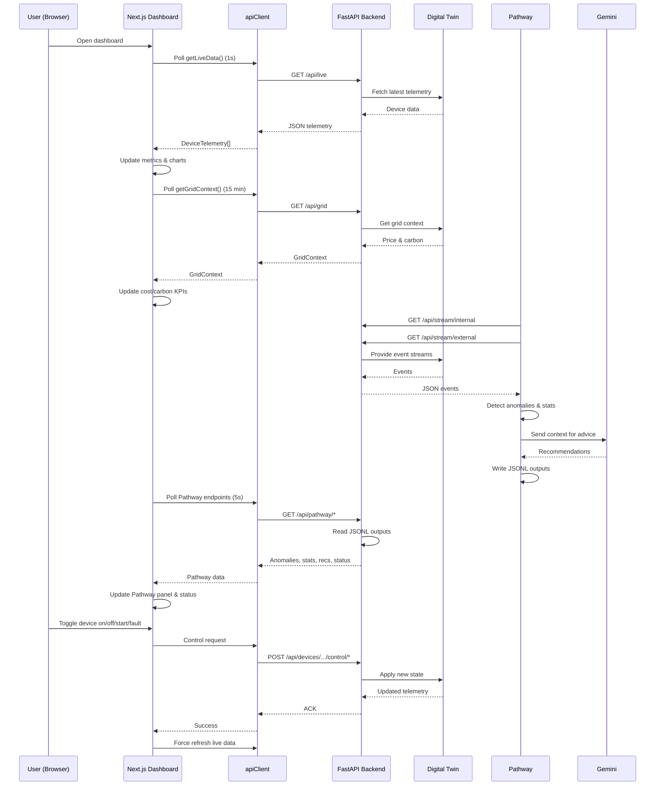

### GridSense AI – Real-Time Energy Intelligence

GridSense AI is a real-time energy monitoring and intelligence system that detects financial waste, operational inefficiency, and carbon-heavy usage as it happens. It continuously processes live device telemetry and grid context to surface plain-language, actionable recommendations that reduce costs and emissions.

### Problem & Solution

- **The problem**: Traditional energy systems report usage too late, causing:
    - **Peak demand penalties** from short-lived demand spikes.
    - **Operational waste** from aging or faulty equipment (phantom loads).
    - **Carbon blindness** because users cannot see when the grid is clean vs. dirty.
- **The solution**: GridSense AI uses a streaming architecture to:
    - Detect anomalies (spikes, faults, voltage issues) in milliseconds.
    - Join internal device data with external grid price/carbon data.
    - Use LLMs to generate simple, actionable recommendations (e.g., “Pause the compressor for 20 minutes to avoid peak charges.”).

---

### System Architecture

The system is built as a streaming, REST-based architecture with four main layers:

- **Digital Twin (Data Layer)**: Python-based simulator that generates realistic Voltage/Current/Power telemetry for industrial devices.
- **Intelligence Engine (Logic Layer)**: Pathway streaming processor that ingests internal and external streams, detects anomalies, and computes statistics.
- **Control Plane (Application Layer)**: FastAPI backend exposing REST endpoints for telemetry, control, and Pathway analytics.
- **Operational Dashboard (Presentation Layer)**: Next.js frontend for real-time visualization, manual controls, and AI insights.

**Architecture diagram (Mermaid):**

---

### System Workflow

At a high level, the system runs three continuous loops plus interactive controls:

- **1. Telemetry & grid polling**
    - Dashboard polls `GET /api/live` every 1s for device telemetry.
    - Dashboard polls `GET /api/grid` every ~15 minutes for price and carbon intensity.
    - UI updates metrics, charts, and device tables in real time.

- **2. Stream processing & AI recommendations**
    - Pathway polls:
        - `GET /api/stream/internal` at high frequency (e.g., 10 Hz) for device data.
        - `GET /api/stream/external` at lower frequency for grid context.
    - Pathway:
        - Joins device and grid streams.
        - Detects anomalies (inrush vs. locked rotor, overcurrent, voltage issues).
        - Computes device statistics and total power.
        - Calls Gemini to generate human-readable optimization recommendations.
    - Results are continuously appended as JSONL files under `pathway_output/`.

- **3. Pathway analytics polling (UI)**
    - Dashboard polls `GET /api/pathway/status`, `/anomalies`, `/recommendations`, `/statistics` every few seconds.
    - FastAPI reads the JSONL outputs and returns structured anomalies, stats, and recommendations.
    - UI updates the Pathway panel and overall system status.

- **4. Device control workflow**
    - User triggers actions (on/off/start/fault) from the UI.
    - Dashboard calls FastAPI control endpoints.
    - Simulator updates its internal state, which is reflected in subsequent telemetry.
    - Pathway sees the new patterns and updates analytics accordingly.

**Workflow diagram (Mermaid sequence):**

---

### Technology Stack

- **Frontend**
    - **Next.js / React (TypeScript)**: Real-time dashboard, charts, control panel, AI insights.
    - **Tailwind CSS / modern UI components**: Responsive and dashboard-friendly layout.

- **Backend**
    - **FastAPI (Python)**: REST API for live telemetry, device control, grid context, and Pathway analytics.
    - **Python digital twin simulator**: Physics-based motor and grid behavior (idle, startup, steady, fault, voltage swell).

- **Stream Processing & AI**
    - **Pathway**: High-performance streaming engine for anomaly detection, statistics, and aggregations.
    - **Gemini (gemini-3-flash-preview)**: LLM used to turn raw metrics into clear, actionable recommendations.

- **Languages**
    - **Python** for backend, simulation, and stream processing.
    - **TypeScript** for frontend and API client.
